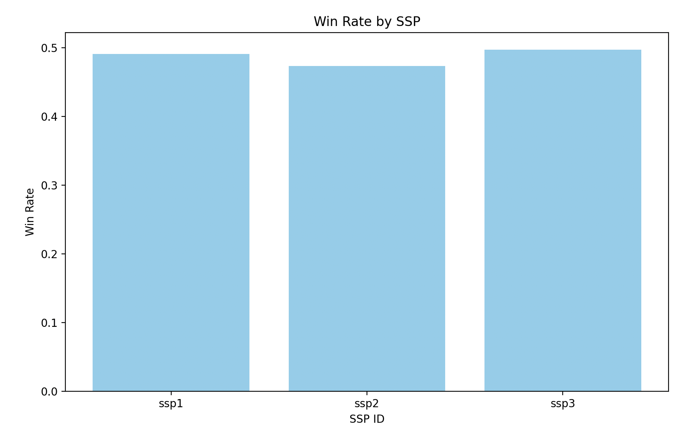
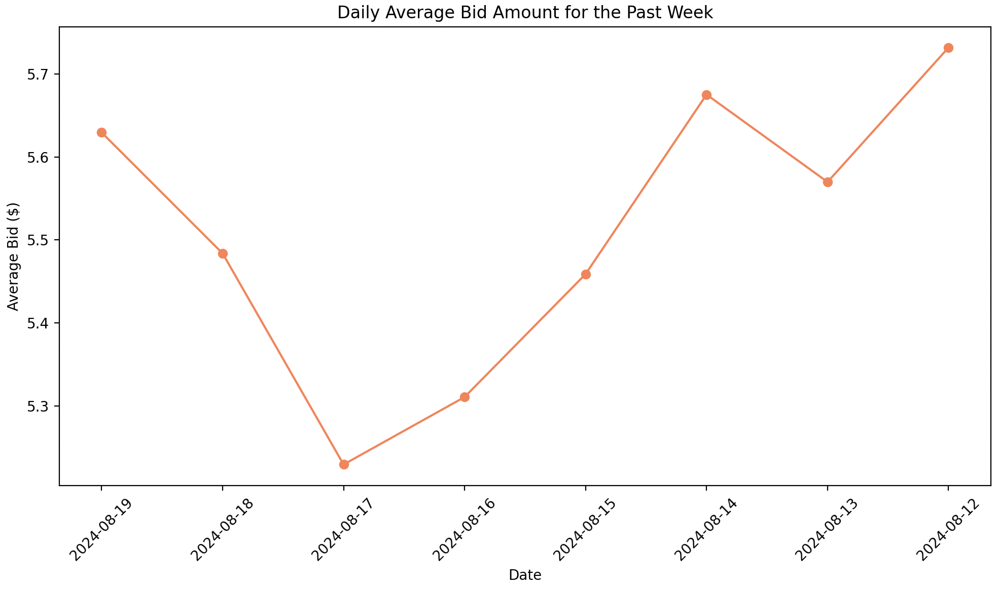

# Performance Optimization in Ad Tech Bidding

This project demonstrates optimization techniques for bidding processes in ad tech, where performance is critical, and milliseconds can make a significant difference. The project includes both an unoptimized and an optimized version of a bidding simulation, with visualizations to compare their performance.

## Features
- **Bidding Simulation**: Simulates a real-world ad tech bidding process, including network latency, using both unoptimized and optimized approaches.
- **Performance Optimization**: Demonstrates techniques to optimize the bidding process, such as parallel processing, caching, and algorithmic improvements.
- **Execution Time Comparison**: Measures and compares the execution time of the unoptimized and optimized bidding processes to showcase the impact of optimizations.
- **Win Rate and Spend Analysis**: Analyzes bid data to calculate win rates for Supply-Side Platforms (SSPs) and identify top advertisers by spend.
- **Data Visualization**: Generates visualizations to present key metrics such as win rates, top advertisers, and daily average bid amounts.
- **SQLite Integration**: Utilizes SQLite to store and analyze bid data, demonstrating how to work with databases in an ad tech context.

## Requirements

Make sure you have the following Python packages installed:

- `matplotlib`
- `concurrent.futures`

You can install these dependencies using pip:

```bash
pip install matplotlib
```

## Ad Tech SQL Analysis

This project also demonstrates how to generate, store, and analyze bid data using SQLite for an ad tech environment. It simulates an ad bidding process where different advertisers bid on impressions through various Supply-Side Platforms (SSPs). The data generated is then used to perform several analytical queries to derive insights such as win rates for SSPs, top advertisers by spend, and average bid amounts over time.

## Table of Contents

- [Project Overview](#project-overview)
- [Installation](#installation)
- [Usage](#usage)
- [Queries and Analysis](#queries-and-analysis)
  - [Win Rate for Each SSP](#win-rate-for-each-ssp)
  - [Top 3 Advertisers by Total Spend](#top-3-advertisers-by-total-spend)
  - [Daily Average Bid Amount for the Past Week](#daily-average-bid-amount-for-the-past-week)
- [Visualizations](#visualizations)
- [Closing the Connection](#closing-the-connection)
- [Contributing](#contributing)
- [License](#license)

## Project Overview

As a Senior Product Manager in Ad Tech, understanding bidding dynamics and analyzing the data generated from programmatic auctions is crucial. This project simulates the generation of bid data, stores it in an SQLite database, and provides several SQL queries to analyze key metrics like SSP win rates, top advertisers by spend, and bid amount trends over time.

## Installation

1. **Clone the repository:**
   ```bash
   git clone https://github.com/peterduhon/SQL-Analysis.git
   cd SQL-Analysis
   ```

2. **Install Python and SQLite:**
   Make sure you have Python 3.x installed. SQLite comes pre-installed with Python.

3. **Run the script:**
   ```bash
   python3 ad_tech_sql_analysis.py
   ```

## Usage

The script creates a sample SQLite database (`adtech.db`) and populates it with synthetic bid data. It then performs a series of SQL queries to extract insights from the generated data. The queries and results are printed to the console.

## Queries and Analysis

### Win Rate for Each SSP

This query calculates the win rate for each SSP by averaging the win column, counting the total bids, and summing the total bid amount.

```sql
SELECT ssp_id, 
       AVG(win) as win_rate, 
       COUNT(*) as total_bids,
       SUM(bid_amount) as total_bid_amount
FROM bids
GROUP BY ssp_id;
```



### Top 3 Advertisers by Total Spend

This query identifies the top 3 advertisers based on their total spend (only counting winning bids).

```sql
SELECT advertiser_id, SUM(bid_amount) as total_spend
FROM bids
WHERE win = 1
GROUP BY advertiser_id
ORDER BY total_spend DESC
LIMIT 3;
```


### Daily Average Bid Amount for the Past Week

This query calculates the daily average bid amount for the past seven days.

```sql
SELECT DATE(timestamp) as date, AVG(bid_amount) as avg_bid
FROM bids
WHERE timestamp >= DATE('now', '-7 days')
GROUP BY DATE(timestamp)
ORDER BY date DESC;
```



## Visualizations

This project includes visualizations for the following metrics:
- **Win Rate by SSP**
- **Top 3 Advertisers by Total Spend**
- **Daily Average Bid Amount for the Past Week**

These visualizations help in understanding the distribution and performance of bids across different SSPs, advertisers, and time periods.

## Closing the Connection

The script ensures that the connection to the SQLite database is properly closed after all operations are completed.

```python
conn.close()
```

To make the A/B test aspect explicit, you could update your **README.md** or documentation to include a dedicated section for A/B testing. Here's how you could phrase it:

### A/B Testing Performance
This project includes an A/B test comparing the **unoptimized** and **optimized** versions of the bidding process. The goal is to analyze the impact of various optimization techniques on bid performance. Metrics like execution time, win rates, and advertiser spend are visualized and compared to highlight the improvements gained through optimization.

This will clarify the testing methodology for users and contributors.

## Contributing

Contributions are welcome! Please submit a pull request or open an issue to discuss any changes or additions.

## License

This project is licensed under the MIT License. See the `LICENSE` file for more details.
```
